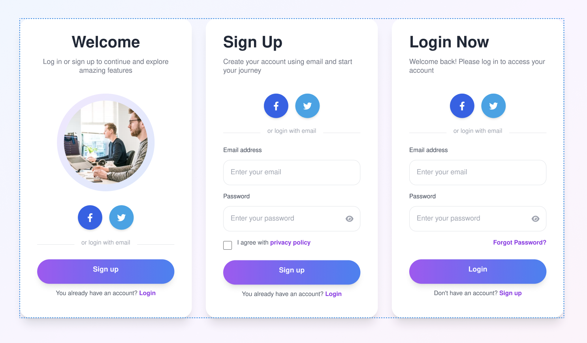
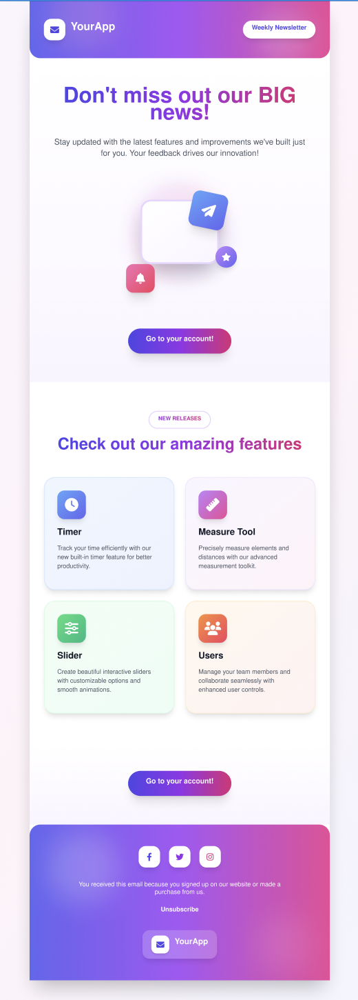
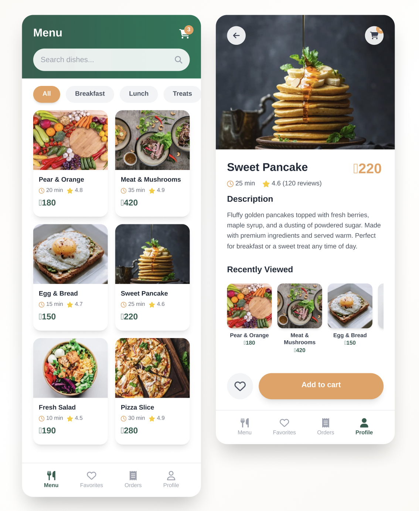

# Codsoft UI Tasks

This repository contains my UI/UX design tasks created using Figma as part of the CODSOFT internship.

---

## Task 1 – Mobile App Login UI
🔗 Figma Link: [https://www.figma.com/file/TASK1_LINK](https://www.figma.com/design/KYVvVwaPMtpQW71SsZpOvZ/Task-1?node-id=0-1&t=LzT5hXchstu0zyGZ-1)

---

## Task 2 – Email UI
🔗 Figma Link: [https://www.figma.com/file/TASK2_LINK](https://www.figma.com/design/9gH3RKBlEBPhDt55l80BEo/Task-2?t=LzT5hXchstu0zyGZ-1)

---

## Task 3 – Resturant UI
🔗 Figma Link: [https://www.figma.com/file/TASK3_LINK](https://www.figma.com/design/8ft2yEXNRmGwGXpjmFQMg9/Task-3?t=LzT5hXchstu0zyGZ-1)

